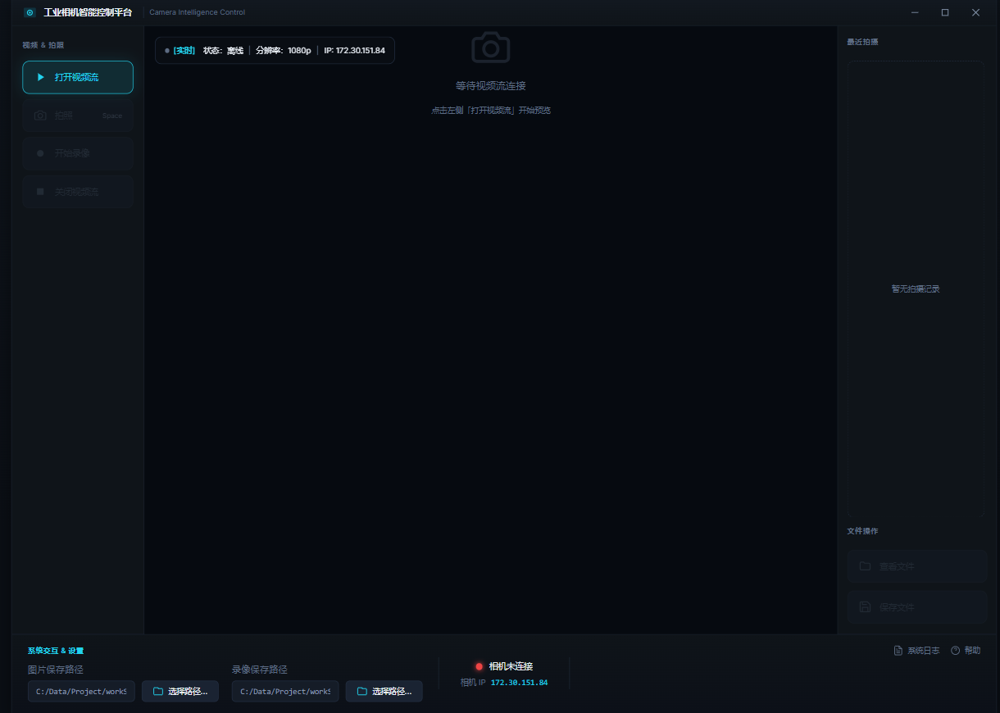
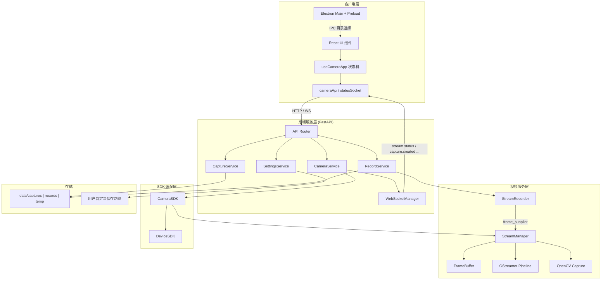
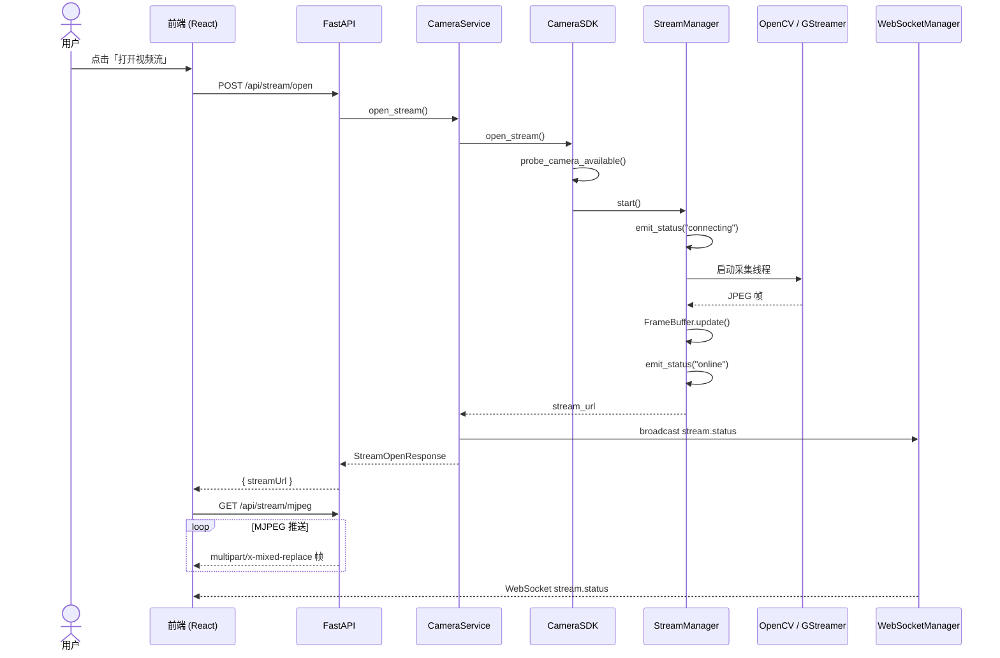
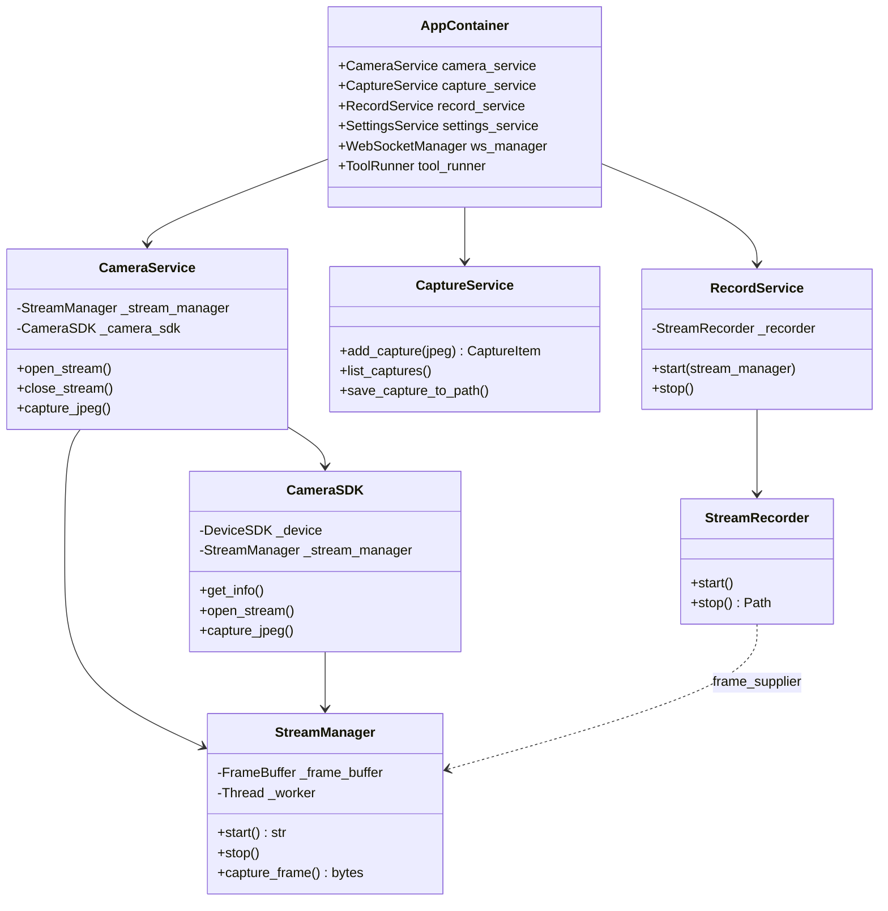

# CameraShow

**工业相机智能控制平台** — 基于前后端分离架构的跨平台相机采集、实时预览、拍照与录像解决方案。

CameraShow 将 **Electron 桌面客户端**、**FastAPI 后端服务** 与 **可插拔的视频/SDK 适配层** 解耦组合，适用于工业视觉、质检监控、实验室图像采集等需要本地相机控制与媒体管理的场景。项目可作为工业相机软件原型、教学示例或二次开发基础框架。



---

## 目录

- [功能特性](#功能特性)
- [技术栈](#技术栈)
- [系统架构](#系统架构)
- [项目结构](#项目结构)
- [环境要求](#环境要求)
- [安装与部署](#安装与部署)
- [启动方式](#启动方式)
- [配置说明](#配置说明)
- [API 概览](#api-概览)
- [快捷键](#快捷键)
- [项目意义](#项目意义)
- [后续扩展](#后续扩展)
- [License](#license)

---

## 功能特性

| 模块 | 能力 |
|------|------|
| **实时预览** | 打开/关闭本地摄像头视频流，通过 MJPEG 协议在浏览器/Electron 中低延迟展示 |
| **拍照采集** | 从当前视频帧抓取 JPEG，自动生成缩略图，支持最近 10 条记录浏览 |
| **视频录像** | 后台线程将 MJPEG 帧编码为 MP4，停止后可选 FFmpeg 转码为 H.264 以兼容 HTML5 播放 |
| **媒体管理** | 统一展示最近拍摄的图片与录像，支持预览、导出至自定义目录 |
| **路径配置** | 独立设置图片与录像的默认保存路径（Electron 原生目录选择器 / 后端 Tk 兜底） |
| **状态推送** | WebSocket 实时广播流状态、拍照/录像事件、路径变更，前端无需轮询 |
| **跨平台** | Windows / macOS / Linux 下 OpenCV 采集后端自动适配；可选 GStreamer 高性能管线 |
| **可扩展** | SDK 适配层与第三方工具运行器预留接口，便于接入工业相机 SDK 或外部算法 |

---

## 技术栈

### 前端（`app/frontend/`）

| 类别 | 技术 | 版本 / 说明 |
|------|------|-------------|
| 框架 | React | ^19.1 |
| 语言 | TypeScript | ^5.8 |
| 构建 | Vite | ^6.3 |
| 桌面壳 | Electron | ^42.3 |
| Electron 集成 | vite-plugin-electron | 开发态热重载 Main / Preload |
| UI | 原生 CSS + 自定义组件 | 无边框窗口、响应式画布缩放 |
| 通信 | Fetch REST + WebSocket | 对接 FastAPI 后端 |

### 后端（`app/backend/`）

| 类别 | 技术 | 版本 / 说明 |
|------|------|-------------|
| Web 框架 | FastAPI | >= 0.115 |
| ASGI 服务器 | Uvicorn | >= 0.32 |
| 数据校验 | Pydantic | >= 2.9 |
| 配置 | PyYAML | 多文件 YAML 配置 |
| 依赖注入 | 自定义 AppContainer | 服务生命周期统一管理 |
| 实时通信 | WebSocket | `/api/ws/status` 事件通道 |
| 日志 | RotatingFileHandler | 可配置滚动日志 |

### 视频与设备层

| 类别 | 技术 | 说明 |
|------|------|------|
| 视频采集 | OpenCV (`opencv-python-headless`) | 主采集后端，跨平台 VideoCapture |
| 可选加速 | GStreamer + PyGObject | `prefer_gstreamer: true` 时优先，失败自动降级 OpenCV |
| 帧缓冲 | 自研 `FrameBuffer` | 线程安全 MJPEG 帧共享 |
| 录像编码 | OpenCV VideoWriter (mp4v) | 后台线程写入 MP4 |
| 转码 | FFmpeg（可选） | 停止录像后转 H.264 + faststart |
| 图像处理 | Pillow | 缩略图生成 |
| SDK 适配 | `sdk_adapter/` | DeviceSDK / CameraSDK 门面模式 |
| 平台工具 | `platform_utils.py` | 路径解析、原生目录选择、采集后端选择 |

### 开发与运维

| 类别 | 工具 |
|------|------|
| API 文档 | FastAPI 自动生成 Swagger UI（`/docs`）、ReDoc（`/redoc`） |
| 冒烟测试 | `scripts/smoke_test_api.py` |
| 配置热读 | `@lru_cache` 加载 YAML（修改后需重启） |

---

## 系统架构

### 分层架构图



### 打开视频流时序图（UML Sequence）



### 核心模块类关系图（UML Class）



### 数据流概览

```
摄像头硬件
    ↓ OpenCV / GStreamer 采集
StreamManager（JPEG 帧缓冲）
    ↓                          ↓
GET /api/stream/mjpeg      capture_jpeg() / StreamRecorder
    ↓                          ↓
前端 MediaDisplay          data/captures | data/records
    ↑
WebSocket 状态 / 事件推送
```

---

## 项目结构

```
CameraShow/
├── app/
│   ├── backend/                 # FastAPI 后端
│   │   ├── api/                 # REST / WebSocket 路由
│   │   ├── core/                # 配置、日志、容器、WebSocket 管理
│   │   ├── schemas/             # Pydantic 模型
│   │   ├── services/            # 业务服务层
│   │   └── main.py              # 应用入口
│   └── frontend/                # React + Electron 前端
│       ├── electron/            # Main / Preload 进程
│       ├── src/
│       │   ├── api/             # HTTP / WebSocket 客户端
│       │   ├── components/      # UI 组件
│       │   └── hooks/           # 应用状态逻辑
│       ├── package.json
│       └── vite.config.ts
├── configs/                     # YAML 配置文件
│   ├── app.yaml                 # 服务、日志、路径、CORS
│   ├── camera.yaml              # 摄像头设备参数
│   ├── video.yaml               # 视频编码、GStreamer、帧率
│   └── tools.yaml               # 第三方工具扩展
├── sdk_adapter/                 # 相机 / 设备 SDK 适配
├── video_service/               # 流媒体、录像、转码
├── third_tools/                 # 第三方工具运行器（可扩展）
├── scripts/                     # 辅助脚本
├── data/                        # 运行时数据（captures / records / temp）
├── logs/                        # 应用日志
├── platform_utils.py            # 跨平台工具函数
├── requirements.txt             # Python 依赖
└── run_backend.py               # 后端启动脚本
```

---

## 环境要求

### 必需

| 依赖 | 建议版本 |
|------|----------|
| Python | 3.10+ |
| Node.js | 18+ |
| npm | 9+ |
| 摄像头设备 | USB / 内置摄像头（或配置正确的 `device_index`） |

### 可选

| 依赖 | 用途 |
|------|------|
| [GStreamer](https://gstreamer.freedesktop.org/) | 高性能视频采集（Windows 需安装 MSVC 64-bit SDK） |
| [FFmpeg](https://ffmpeg.org/) | 录像结束后转码为浏览器可播 H.264 |

### 平台相关说明

- **Windows**：OpenCV 默认使用 `CAP_DSHOW` 后端
- **macOS**：使用 `CAP_AVFOUNDATION`
- **Linux**：使用 `CAP_V4L2`

---

## 安装与部署

### 1. 克隆仓库

```bash
git clone https://github.com/Anpinx/CameraShow.git
cd CameraShow
```

### 2. 安装 Python 依赖

建议使用虚拟环境：

```bash
python -m venv .venv

# Windows
.venv\Scripts\activate

# macOS / Linux
source .venv/bin/activate

pip install -r requirements.txt
```

### 3. 安装前端依赖

```bash
cd app/frontend
npm install
cd ../..
```

### 4. 配置文件

复制并根据本机环境修改 `configs/` 下的 YAML 文件，重点检查：

- `configs/camera.yaml` — 摄像头索引与分辨率
- `configs/video.yaml` — GStreamer 路径（若使用）
- `configs/app.yaml` — 服务端口与数据目录

### 5. 生产构建（可选）

**前端静态资源：**

```bash
cd app/frontend
npm run build
# 产物输出至 app/frontend/dist/
```

**Electron 主进程编译：**

```bash
npm run electron:build
# 产物输出至 app/frontend/dist-electron/
```

> 当前仓库提供 Vite + Electron 开发与构建脚本；如需生成安装包，可在此基础上集成 `electron-builder` 等打包工具。

---

## 启动方式

CameraShow 采用 **后端 + 前端** 双进程模式。开发时两者需同时运行。

### 方式 A：Web 开发模式（推荐调试 UI）

**终端 1 — 启动后端：**

```bash
# 在项目根目录
python run_backend.py
```

后端默认监听 `http://127.0.0.1:8000`，可访问：

- Swagger UI：<http://127.0.0.1:8000/docs>
- ReDoc：<http://127.0.0.1:8000/redoc>

**终端 2 — 启动前端开发服务器：**

```bash
cd app/frontend
npm run dev
```

浏览器访问 <http://localhost:5173>。

如需指定后端地址：

```bash
# Windows PowerShell
$env:VITE_API_BASE="http://127.0.0.1:8000"
npm run dev

# macOS / Linux
VITE_API_BASE=http://127.0.0.1:8000 npm run dev
```

### 方式 B：Electron 桌面模式

先启动后端，再启动 Electron 开发环境：

```bash
# 终端 1
python run_backend.py

# 终端 2
cd app/frontend
npm run electron:dev
```

Electron 窗口将加载 Vite 开发服务器，并通过 Preload 暴露窗口控制与原生目录选择能力。

### 方式 C：生产预览

```bash
python run_backend.py

cd app/frontend
npm run build
npm run preview   # 静态站点预览，默认 http://localhost:4173
```

### 验证安装

后端启动后，可运行冒烟测试（需摄像头可用）：

```bash
python scripts/smoke_test_api.py
```

---

## 配置说明

### `configs/app.yaml`

| 键 | 说明 | 默认值 |
|----|------|--------|
| `app.host` | 后端绑定地址 | `127.0.0.1` |
| `app.port` | 后端端口 | `8000` |
| `app.debug` | Uvicorn 热重载 | `false` |
| `paths.captures` | 拍照缓存目录 | `data/captures` |
| `paths.records` | 录像缓存目录 | `data/records` |
| `settings.max_captures` | 最近拍照保留条数 | `10` |
| `settings.max_records` | 最近录像保留条数 | `10` |

默认保存路径为空时，分别使用：

- 图片：`~/Pictures/Camera_Captures`
- 录像：`~/Pictures/Camera_Records`

### `configs/camera.yaml`

| 键 | 说明 | 默认值 |
|----|------|--------|
| `camera.device_index` | 摄像头索引 | `0` |
| `camera.device_name` | 设备名称（GStreamer 可用） | `""` |
| `camera.width` / `height` | 采集分辨率 | `1920` / `1080` |
| `camera.fps` | 采集帧率 | `30` |

### `configs/video.yaml`

| 键 | 说明 | 默认值 |
|----|------|--------|
| `video.prefer_gstreamer` | 是否优先 GStreamer | `true` |
| `video.gstreamer_bin` | GStreamer `bin` 目录 | 需按本机安装路径填写 |
| `video.jpeg_quality` | MJPEG JPEG 质量 | `85` |
| `video.mjpeg_fps` | 预览推流帧率 | `15` |
| `video.record_fps` | 录像帧率 | `15` |

> **注意**：请将 `gstreamer_bin` 修改为本机 GStreamer 安装路径；若未安装 GStreamer，保持 `prefer_gstreamer: true` 即可，系统会自动降级为 OpenCV。

---

## API 概览

| 方法 | 路径 | 说明 |
|------|------|------|
| GET | `/api/camera/info` | 相机 / 主机信息 |
| POST | `/api/stream/open` | 打开视频流 |
| POST | `/api/stream/close` | 关闭视频流 |
| GET | `/api/stream/status` | 流状态 |
| GET | `/api/stream/mjpeg` | MJPEG 实时流 |
| POST | `/api/capture` | 拍照 |
| GET | `/api/captures` | 拍照列表 |
| POST | `/api/captures/save` | 导出图片 |
| POST | `/api/record/start` | 开始录像 |
| POST | `/api/record/stop` | 停止录像 |
| GET | `/api/record/status` | 录像状态 |
| GET | `/api/records` | 录像列表 |
| GET | `/api/settings` | 读取设置 |
| PUT | `/api/settings/save-path` | 更新图片保存路径 |
| PUT | `/api/settings/record-save-path` | 更新录像保存路径 |
| WS | `/api/ws/status` | 实时状态与事件 |

### WebSocket 事件

| 事件名 | 触发时机 |
|--------|----------|
| `stream.status` | 流上线 / 下线 / 连接中 |
| `capture.created` | 新拍照完成 |
| `capture.saved` | 图片导出完成 |
| `record.status` | 录像状态变更 |
| `record.created` | 新录像入库 |
| `record.stopped` | 录像停止 |
| `settings.save_path` | 图片路径更新 |
| `settings.record_save_path` | 录像路径更新 |

---

## 快捷键

| 按键 | 功能 |
|------|------|
| `Space` | 拍照（视频流在线且未在录像时） |
| `Esc` | 从文件预览返回实时画面 |

---

## 项目意义

### 1. 工程化参考实现

CameraShow 展示了如何将 **桌面 UI**、**REST/WebSocket 服务** 与 **底层视频采集** 三层解耦：

- 前端只关心 API 契约，不直接操作硬件
- 后端通过 Service + Container 组织业务，便于单元测试与替换
- `sdk_adapter` 与 `video_service` 独立，可平滑替换为海康、大华等工业相机 SDK

### 2. 工业视觉场景落地基础

- **实时预览 + 抓拍 + 录像** 是质检、安防、实验记录等场景的共性需求
- MJPEG 推流方案简单可靠，易于在 Electron / WebView 中集成
- 可选 GStreamer 管线为后续接入 RTSP、硬件编码、多路流打下基础

### 3. 跨平台与可运维

- 统一的 YAML 配置、结构化日志、OpenAPI 文档降低部署与排障成本
- `platform_utils` 封装 OS 差异，同一套代码可在 Windows 工控机与 Linux 边缘设备运行

### 4. 开源协作与二次开发

- 模块化目录清晰，适合作为 GitHub 开源项目的起点
- `third_tools` 预留外部算法 / MES / PLC 联动扩展点
- 完整的架构图与 API 说明降低新贡献者上手门槛

---

## 后续扩展

- [ ] 接入真实工业相机 SDK（替换 `DeviceSDK` 探测逻辑）
- [ ] RTSP 网络相机支持（`video_service/rtsp_client.py` 已预留）
- [ ] 启用 `third_tools` 对接 OpenCV / YOLO 等检测流水线
- [ ] Electron 安装包打包（electron-builder）
- [ ] Docker 化后端服务（无 GUI 部署）

---

## License

本项目尚未指定开源协议。发布至 GitHub 前，请根据实际情况添加 `LICENSE` 文件（如 MIT、Apache-2.0 等）。

---

## 贡献

欢迎通过 Issue 与 Pull Request 参与改进。提交 PR 前请确保：

1. 后端可正常启动：`python run_backend.py`
2. 前端可正常构建：`cd app/frontend && npm run build`
3. 变更涉及 API 时同步更新本文档

---

<p align="center">
  <sub>CameraShow — Built with FastAPI, React & Electron</sub>
</p>
